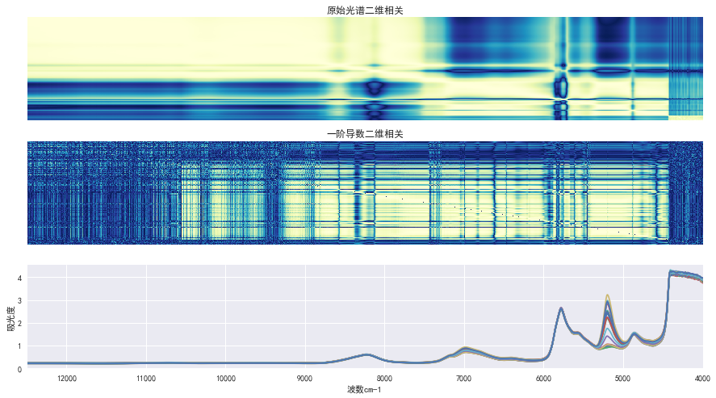

```python
from Chemometrics.import_common import *
from Chemometrics.spectra_utils import derivative
plt.rcParams['font.sans-serif'] = 'SimHei'
% matplotlib inline
```


```python
ir = pload('tw20_IR.p')
```


```python
ir_ = ir.groupby(ir.index).mean()
```


```python
corr = np.corrcoef(ir_.T)
d1 = derivative(ir_.T,1) # 去掉基线随时间的线性漂移
d1_corr = np.abs(np.corrcoef(d1))
tmp = d1_corr.copy()
np.fill_diagonal(tmp,0)
```


```python
f = plt.figure(figsize=(15,20))
ax1 = f.add_subplot(311)
plt.title('原始光谱二维相关')
sns.heatmap(np.abs(corr),xticklabels=False,ax=ax1,yticklabels=False,cmap=plt.cm.YlGnBu_r,cbar=False)
ax2 = f.add_subplot(312)
plt.title('一阶导数二维相关')
sns.heatmap(tmp,ax=ax2,xticklabels=False,yticklabels=False,cmap=plt.cm.YlGnBu_r,cbar=False)
ax3 = f.add_subplot(313)
ir_.T.plot(figsize=(15,8),legend=False,ax=ax3)
plt.xlabel('波数cm-1')
plt.ylabel('吸光度')
f.savefig('吐温20二维相关.png',dpi=300)
```




